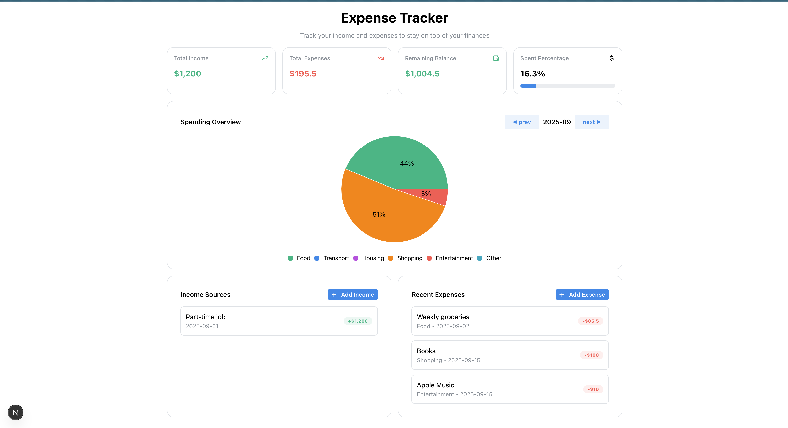

# TrackMyCash

An income & expense tracker for students.  
Built with **Next.js + Mantine (frontend)** and **C# .NET + PostgreSQL (backend)**.

The app lets you:

- Record incomes (salary, scholarships, gifts, etc.)
- Record expenses (food, transport, entertainment, etc.)
- View summaries of your monthly finances (totals, balance, percentages, pie chart)

---

## Installation

### Prerequisites

- Node.js (>=18)
- .NET 8 SDK
- PostgreSQL (or SQLite for dev)

### Backend Setup

```bash
# Clone repo and go to backend folder
cd backend/MoneyApi

# Install dependencies & build
dotnet restore
dotnet build

# Apply DB migrations
dotnet ef database update

# Run API
dotnet run
```

Backend will run at:  
`http://localhost:5015` (Swagger UI at `/swagger`)

### Frontend Setup

```bash
# Go to frontend folder
cd frontend

# Install dependencies
npm install

# Run dev server
npm run dev
```

Frontend will run at:  
`http://localhost:3000`

### Environment variables

Create `.env.local` in `frontend/`:

```
NEXT_PUBLIC_API_BASE_URL=http://localhost:5015
```

In `backend/appsettings.json` update your PostgreSQL connection:

```json
{
  "ConnectionStrings": {
    "DefaultConnection": "Host=localhost;Database=trackmycash;Username=postgres;Password=yourpassword"
  }
}
```

---

## Usage Examples

### Adding Income

```bash
curl -X POST http://localhost:5015/api/incomes \
  -H "Content-Type: application/json" \
  -d '{"date":"2025-09-01","amount":1200,"source":"Part-time job"}'
```

### Adding Expense

```bash
curl -X POST http://localhost:5015/api/expenses \
  -H "Content-Type: application/json" \
  -d '{"date":"2025-09-02","amount":85.5,"category":"Food","description":"Weekly groceries"}'
```

### Get Monthly Summary

```bash
curl "http://localhost:5015/api/summary?year=2025&month=9"
```

Response:

```json
{
  "totalIncome": 1860,
  "totalExpenses": 285.5,
  "remaining": 1574.5,
  "spentPercentage": 15.3,
  "categories": [
    { "category": "Food", "amount": 125.5 },
    { "category": "Transport", "amount": 25.0 },
    { "category": "Education", "amount": 120.0 },
    { "category": "Entertainment", "amount": 15.0 }
  ]
}
```

---

## 📚 API Endpoints

- `POST /api/incomes` – Add income
- `POST /api/expenses` – Add expense
- `GET /api/incomes?year=YYYY&month=MM` – List incomes by month
- `GET /api/expenses?year=YYYY&month=MM` – List expenses by month
- `GET /api/summary?year=YYYY&month=MM` – Monthly summary

Swagger available at: `http://localhost:5015/swagger`

---

## 🛣 Roadmap

- [x] Basic CRUD for incomes & expenses
- [x] Monthly summaries (totals, balance, percentage spent)
- [x] Frontend chart visualization with Mantine PieChart
- [ ] User authentication (multi-user support)
- [ ] Deploy backend to Railway / Render
- [ ] Deploy frontend to Vercel
- [ ] Categories with icons & budgets
- [ ] Export reports (CSV / PDF)

---
